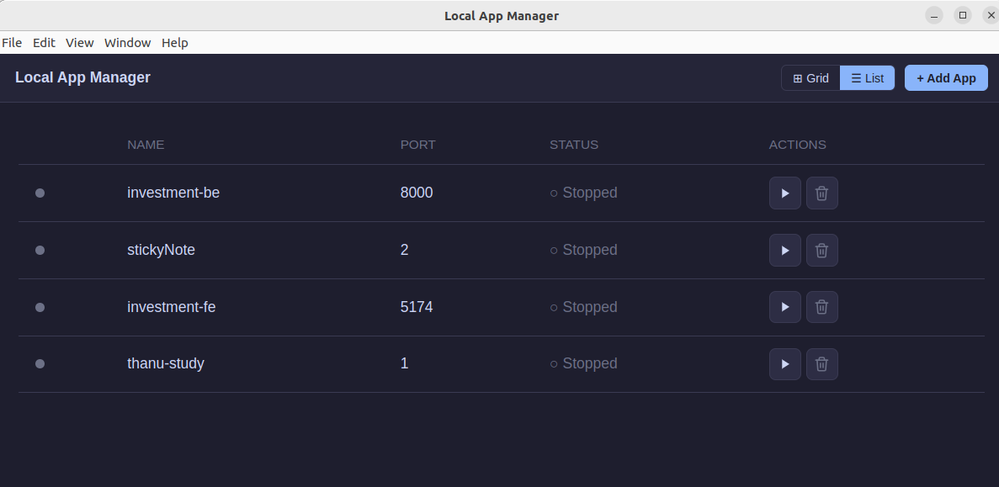
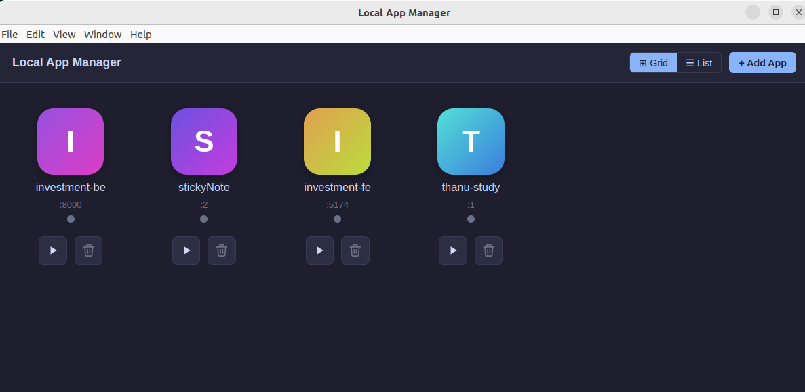

# Local App Manager

A tiny Electron desktop app for registering, starting, and stopping local development servers from one place. Each app is a name + port + shell command; the manager spawns them as detached process groups so they outlive the UI, tails their logs, and tracks status by PID.





## Features

- Register any local app with a name, port, and shell command.
- Grid or list view, with inline start / stop / delete actions.
- Live log tail per app (last 64 KB on open, streaming after that).
- Detached process groups — your dev servers keep running even if you close the manager.
- PID-first, port-fallback, tree-kill stop logic so orphaned processes get cleaned up.
- CLI companion (`local-app`) for one-line registration from any project directory.

## Requirements

- Node.js 20+
- npm
- Linux or macOS (Windows is untested; process-group semantics assume Unix)

## Install & run

```sh
git clone https://github.com/gvgbalaji/local-app-manager.git
cd local-app-manager
npm install
npm run dev
```

`npm run dev` compiles the Electron main process in watch mode, starts Vite for the renderer, and launches Electron once both are ready. Ctrl-C stops everything.

For a production-style run:

```sh
npm run build
npm start
```

## Using the UI

1. Click **+ Add App**.
2. Enter a display name, the port the app listens on, and the shell command to run it (e.g. `cd ~/projects/my-app && npm run dev`).
3. Hit the ▶ button to start it. Status turns green once the PID is alive.
4. Click a row/tile to open the detail panel with live logs.
5. Use the ■ button to stop, or the 🗑 button to delete.

Config lives at `~/.config/local-app-manager/apps.json` on Linux and `~/Library/Application Support/local-app-manager/apps.json` on macOS. Logs live under `logs/<id>.log` in the same directory (ring-buffered at 10 MB, one backup kept).

## CLI: register apps from the terminal

After `npm run build`, link the CLI once:

```sh
npm link
```

This installs a global `local-app` command. Then from any project directory:

```sh
cd ~/projects/stickies
local-app add -p 3000 -- npm run dev
```

That writes an entry with:
- **name**: `stickies` (directory basename, unless `-n` is given)
- **port**: `3000`
- **command**: `cd "/home/you/projects/stickies" && npm run dev`

The UI polls `apps.json` every 3 seconds, so the new entry appears without restarting the manager.

### Options

| Flag | Description | Default |
|------|-------------|---------|
| `-p, --port <port>` | Port the app listens on. Required. | — |
| `-n, --name <name>` | Display name. | Basename of `--cwd` |
| `-d, --cwd <dir>` | Working directory baked into the command. | `$PWD` |
| `--` | Everything after `--` is the command to run. | — |

### Examples

```sh
# Simplest: derive name from the current directory
cd ~/projects/stickies
local-app add -p 3000 -- npm run dev

# Custom display name
local-app add -p 5174 -n "Portfolio Web" -- npm run dev

# Register a project without cd'ing into it
local-app add -p 8000 -n portfolio-api -d ~/projects/gv-portfolio/portfolio-api -- bash start.sh

# List registered apps
local-app list
```

### Suggested shell alias

Drop this in `~/.zshrc` or `~/.bashrc`:

```sh
alias localApp='local-app add'
```

Then: `localApp -p 3000 -- npm run dev` from inside any project.

### Port collisions

Port uniqueness is a **warning**, not a hard error — both in the UI and in the CLI — so you can register ports that clash with an existing entry if you know what you're doing.

## Architecture overview

Electron app split along the preload boundary:

- **Main process** (`electron/`, CommonJS): all process management, filesystem IO, IPC handlers.
- **Renderer** (`src/`, React + Vite, ESM): pure UI. Talks to the main process only through `window.api`, exposed by `electron/preload.ts`. `contextIsolation: true`, `nodeIntegration: false`.

### Process lifecycle

- **Spawn is detached.** Children start with `spawn('sh', ['-c', cmd], { detached: true, stdio: [ignore, fileFd, fileFd] })`. `child.unref()` lets Electron exit without waiting.
- **Runtime state is persisted** to `state.json` (`{ appId: {pid, pgid, startedAt} }`) — the only way to rediscover detached children after an Electron restart.
- **Status = PID alive.** Port-binding is checked only for the pre-start collision check and the stop-fallback path.
- **Stop is tree-kill.** `kill(-pgid, SIGTERM)` → wait up to 5 s for the port to free → `SIGKILL`. Fallback: find the PID bound to the port via `lsof`, derive its pgid via `ps`, tree-kill that.

See `CLAUDE.md` and `docs/superpowers/specs/2026-04-22-local-app-manager-design.md` for the full design notes.

## Scripts

| Script | What it does |
|--------|--------------|
| `npm run dev` | Watch-compile main + run Vite + launch Electron |
| `npm run build` | One-shot TS compile + Vite build, marks `cli.js` executable |
| `npm start` | Launch Electron against the built output |
| `npm run typecheck` | Typecheck both renderer and main TS projects (no emit) |
| `npm run test:main` | Run main-process unit tests via `node --test` |

## Non-goals

Deliberately out of scope (see the design doc):

- Per-app env vars or working-dir config beyond what the command line already provides
- Multi-port apps
- Auto-start-on-login configuration inside the app
- Log search / filter
